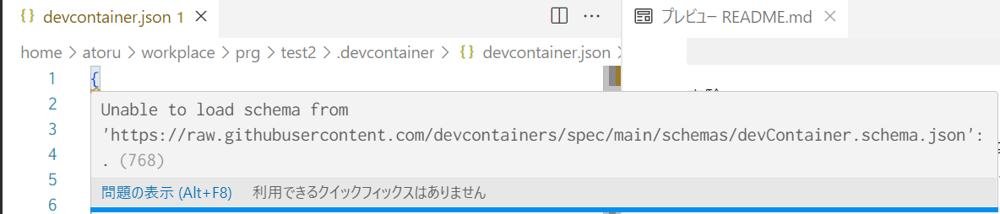
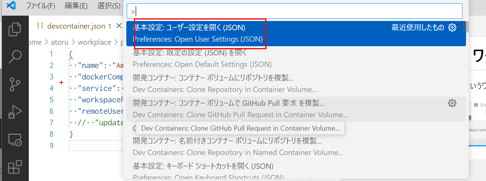
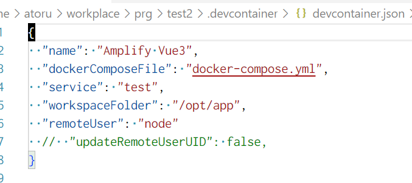
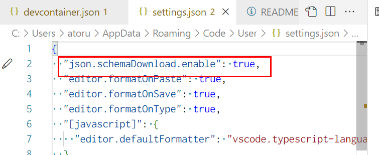

<h1>docker non root user</h1>

コンテナのユーザーとホストのユーザーを合わせる。

vscode の devcontaier の機能を使って、実現するのがお手軽。しかし、コンテナサイズが大きくなる、コンテナビルドに時間がかかるなどオーバーヘッドが気なるときは、devcontaier の機能をオフして、手動で合わせる。

- [フォルダ構成](#フォルダ構成)
- [ホストとコンテナのユーザー ID を調べる](#ホストとコンテナのユーザー-id-を調べる)
  - [ホストのユーザー ID](#ホストのユーザー-id)
  - [コンテナのユーザー ID](#コンテナのユーザー-id)
- [vscode の機能を使ってコンテナのユーザー ID を指定する](#vscode-の機能を使ってコンテナのユーザー-id-を指定する)
  - [devcontainer.json](#devcontainerjson)
    - [devcontainer.json ワーニング](#devcontainerjson-ワーニング)
  - [Dockerfile](#dockerfile)
  - [docker-compose.yml](#docker-composeyml)
    - [実験](#実験)
- [vscode の機能を使わず手動でコンテナのユーザー ID を指定する](#vscode-の機能を使わず手動でコンテナのユーザー-id-を指定する)
  - [Dockerfile](#dockerfile-1)
  - [docker-compose.yml](#docker-composeyml-1)
  - [devcontainer.json](#devcontainerjson-1)
  - [動作確認](#動作確認)
- [参考 URL](#参考-url)

# フォルダ構成

```
test2
  |--.devcontainer
    |--devcontainer.json
    |--docker-compose.yml
    |--web
      |--Dockerfile
```

# ホストとコンテナのユーザー ID を調べる

この作業は、vscode の機能を使うときも、使わないときも必要。

## ホストのユーザー ID

ホストの id を調べる。wsl2 上の ubuntu を使うと、デフォルトでは、user id:1000 goup id:1000 となっている。コンテナもデフォルトで user id:1000 goup id:1000 が設定されていることがある。ネット上のサンプルでは、コンテナに user id:1000 goup id:1000 のユーザーを追加する例が多いが、コンテナにデフォルトで設定されていたら、新たに追加する必要はない。逆に、すでにユーザーが存在していると怒られる。

ホストのユーザー ID

```
web $ id
uid=1000(atoru) gid=1000(atoru) groups=1000(atoru),4(adm),20(dialout),24(cdrom),25(floppy),27(sudo),29(audio),30(dip),44(video),46(plugdev),117(netdev),1001(docker)
web $
```

uid=1000 gid=1000 であることがわかる。

## コンテナのユーザー ID

次に、コンテナを作成して、user id ,user group を調べる。

Dockerife

```
FROM node:lts-buster
RUN apt-get update
```

```
root@d1c4fe09e874:/etc# cat passwd
root:x:0:0:root:/root:/bin/bash
daemon:x:1:1:daemon:/usr/sbin:/usr/sbin/nologin
bin:x:2:2:bin:/bin:/usr/sbin/nologin
::::::::
node:x:1000:1000::/home/node:/bin/bash
```

node:lts-buster には、すでに user id:1000 group id:1000 のユーザーが作られている。

node:lts-buster ではすでに、node ユーザーが id:1000 を使っているので、新たなユーザーを追加せず、node ユーザー の id:1000 を使用する。

# vscode の機能を使ってコンテナのユーザー ID を指定する

これがお手軽。特にオーバーヘッドが気にならないときは、これで済ませる。
node:lts-buster の user id:1000 は node という名前なので、これを`
  "remoteUser": "node",`と指定する。updateRemoteUserUID はデフォルトで true となる。

こうすると、user id:1000 でコンテナが起動した。オーバーヘッドが大きいようだが、ファイル数が数万とかならなければ、あまり気にならない。コンテナビルドに時間がかかるようなら、上記の手法を使う。:w

## devcontainer.json

remoteUser にコンテナのユーザー名を設定
updateRemoteUserUID はデフォルトで true なので設定の必要なし。

devcontainer.json

```
{
  "name": "Amplify Vue3",
  "dockerComposeFile": "docker-compose.yml",
  "service": "test",
  "workspaceFolder": "/opt/app",
  "remoteUser": "node",
  //"updateRemoteUserUID": false,
}
```

### devcontainer.json ワーニング

`Unable to load schema from  ...`というワーニングでていた。



```
Unable to load schema from 'https://raw.githubusercontent.com/devcontainers/spec/main/schemas/devContainer.schema.json': .(768)
```

settings.json の先頭に以下の設定を追加したら、でなくなった。先頭に入れないと行けない。

```
"json.schemaDownload.enable": true,
```







[Unable to load schema from vscode://schemas/settings/folder \| bobbyhadz](https://bobbyhadz.com/blog/unable-to-load-schema-from-vscode-cannot-open)

## Dockerfile

Dockerfile

```
web $ cat Dockerfile
FROM node:lts-buster

RUN apt-get update
#    apt-get install vim -y && \
#    groupadd -g 1000 app_user && \
#    useradd -m -s /bin/bash -u 1000 -g 1000 app_user
#RUN mkdir -p /opt/app && chown -R app_user:app_user /opt/app
#RUN mkdir -p /opt/app && chown -R 1000:1000 /opt/app
WORKDIR /opt/app

#USER app_user
#USER 1000
```

## docker-compose.yml

ホストのカレントフォルダをコンテナのフォルダにバインドすること。

```
    volumes:
      - ..:/opt/app
```

docker-compose.yml

```
services:
  test:
    build:
      dockerfile: ./web/Dockerfile
    stdin_open: true
    tty: true
    working_dir: '/opt/app'
    volumes:
      - ..:/opt/app
      # - ./app:/opt/app
      #- ~/.aws/:/root/.aws/
      #    user: "1000:1000"
```

### 実験

docker-compose.yml で`./app:/opt/app`として、docker-compose.yml で新たなフォルダを生成するで新たなフォルダを生成する。そうすると、ホストにバインドされた`./app`はルート権限となる。docker-compose.yml で新しいフォルダを作るとユーザー権限ではアクセスできなくなるので注意。

ホストにユーザー権限で、`./app`を先に作り、docker-compose.yml で新たにフォルダを生成しなければホストの権限のまま。この手法を使うには、docker-compose.yml の先回りが必要。トラブルで悩まないように、docker-compose.yml で新たなフォルダを作らないほうがいい。また、ホストのカレントフォルダをバインドすれば、README.md、プロジェクトフォルダ .devcontainer が同じ階層になり、git で管理しやすいので、 とくに理由がなければ、ホストのカレントフォルダをバインドする。

docker-compose.yml

```
services:
  test:
    build:
      dockerfile: ./web/Dockerfile
    stdin_open: true
    tty: true
    working_dir: '/opt/app'
    volumes:
     # - ..:/opt/app
      - ./app:/opt/app
        #- ~/.aws/:/root/.aws/
#    user: "1000:1000"
```

# vscode の機能を使わず手動でコンテナのユーザー ID を指定する

いろいろ設定が必要なので、最初は vscode の機能を使って、オーバーヘッドが気になったときに、手動にする。

## Dockerfile

```
FROM node:lts-buster

RUN apt-get update
#    apt-get install vim -y && \
#    groupadd -g 1000 app_user && \
#    useradd -m -s /bin/bash -u 1000 -g 1000 app_user
#RUN mkdir -p /opt/app && chown -R app_user:app_user /opt/app
RUN mkdir -p /opt/app && chown -R 1000:1000 /opt/app
WORKDIR /opt/app

#USER app_user
USER node
```

※docker-compose.yml でユーザーを指定して起動するなら必要ないが、Dockerfile の動作検証のために、実行ユーザーを指定した。Dockerfile の動作確認、docker-compose.yml の動作確認と順番を追っていくので実行ユーザーを指定したほうがいい。

ポイントは、WORKDIR でフォルダを作成するのではなく、ユーザー権限のフォルダを先に作って、そのフォルダに移動する。コマンで、フォルダを作成すると、root 権限となってしまう。

```
RUN mkdir -p /opt/app && chown -R 1000:1000 /opt/app
WORKDIR /opt/app
```

コンテナを起動し、コンテ内でファイルを作成し、ホストで権限を確認する。

```
web $ docker run -it bfeb bash
node@bfdc7a628f07:/opt/app$ touch a.txt
node@bfdc7a628f07:/opt/app$ ls
a.txt
node@bfdc7a628f07:/opt/app$
```

ホストで、ユーザー権限となっていることが確認できる。

```
test2 $ ls -la
合計 16
drwxr-xr-x  3 atoru atoru 4096 11月 19 14:40 .
drwxr-xr-x 51 atoru atoru 4096 11月 18 21:39 ..
drwxr-xr-x  3 atoru atoru 4096 11月 19 14:47 .devcontainer
-rw-r--r--  1 atoru atoru 2643 11月 19 15:09 README.md
-rw-r--r--  1 atoru atoru    0 11月 19 14:17 a.txt
```

## docker-compose.yml

user を指定する。

docker-compose.yml

```
services:
  test:
    build:
      dockerfile: ./web/Dockerfile
    stdin_open: true
    tty: true
    working_dir: '/opt/app'
    volumes:
      - ..:/opt/app
        # - ./app:/opt/app
        #- ~/.aws/:/root/.aws/
    user: "1000:1000"
```

## devcontainer.json

vscode の機能をオフする。

```
  "remoteUser": <コンテナのユーザー名>
  "updateRemoteUserUID": false, <<<
```

```
{
  "name": "Amplify Vue3",
  "dockerComposeFile": "docker-compose.yml",
  "service": "test",
  "workspaceFolder": "/opt/app",
  // "remoteUser": "atoru",
  "updateRemoteUserUID": false,
}
```

## 動作確認

vscode でコンテナを起動して、動作確認する

コンテナでファイル作成

```
node@aafdc671b6b6:/opt/app$ touch b.txt
node@aafdc671b6b6:/opt/app$
node@aafdc671b6b6:/opt/app$
```

ホストで権限を確認

```
test2 $ ls -la
合計 20
drwxr-xr-x  3 atoru atoru 4096 11月 19 15:24 .
drwxr-xr-x 51 atoru atoru 4096 11月 18 21:39 ..
drwxr-xr-x  3 atoru atoru 4096 11月 19 15:23 .devcontainer
-rw-r--r--  1 atoru atoru 5012 11月 19 15:20 README.md
-rw-r--r--  1 atoru atoru    0 11月 19 14:17 a.txt
-rw-r--r--  1 atoru atoru    0 11月 19 15:24 b.txt
```

コンテナで作成したファイルの権限がホストのユーザーとなっている。これで OK。

# 参考 URL

[node などのコンテナイメージで devcontainer を使うと uid が変わらなくて困る問題への対処 \- おは代々木ダイアリー](https://ohayoyogi.hatenablog.com/entry/2023/01/12/133415)

[Visual Studio Code リモート開発を使用して開発コンテナを作成する](https://code.visualstudio.com/docs/devcontainers/create-dev-container#_extend-your-docker-compose-file-for-development)

[Docker や VSCode \+ Remote\-Container のパーミッション問題に立ち向かう](https://zenn.dev/forrep/articles/8c0304ad420c8e)

[Docker コンテナ内での作業ユーザー作成方法](https://zenn.dev/aidemy/articles/3b34214b9aabf4)

[devcontainer でホスト側のファイル権限が root になる問題の対処 \- ツー](https://celeron1ghz.hatenablog.com/entry/2024/02/25/110807)
